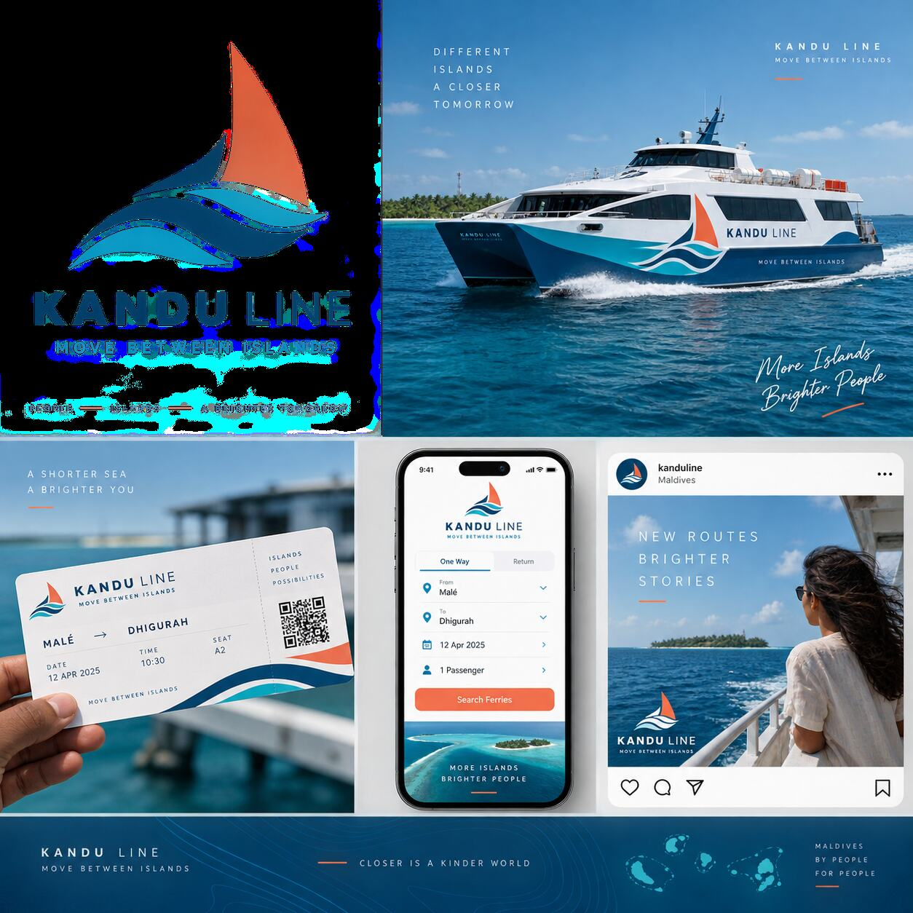
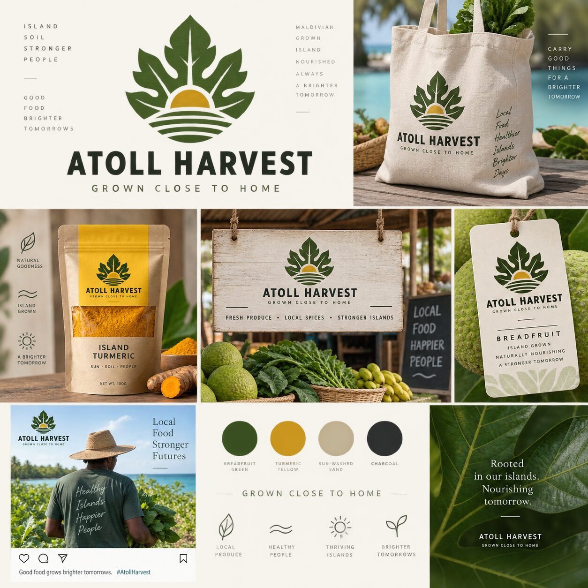
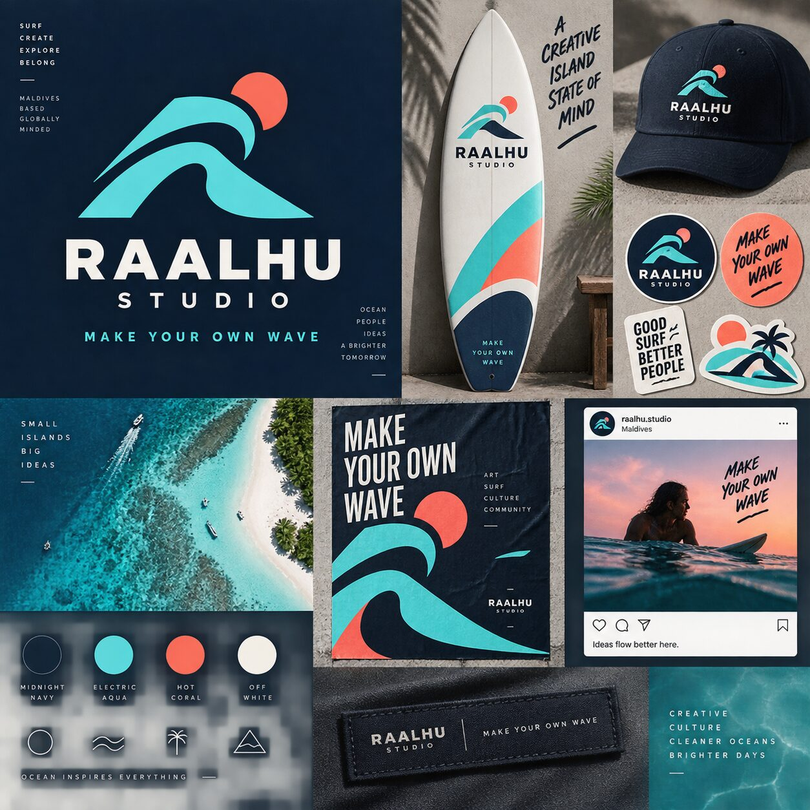
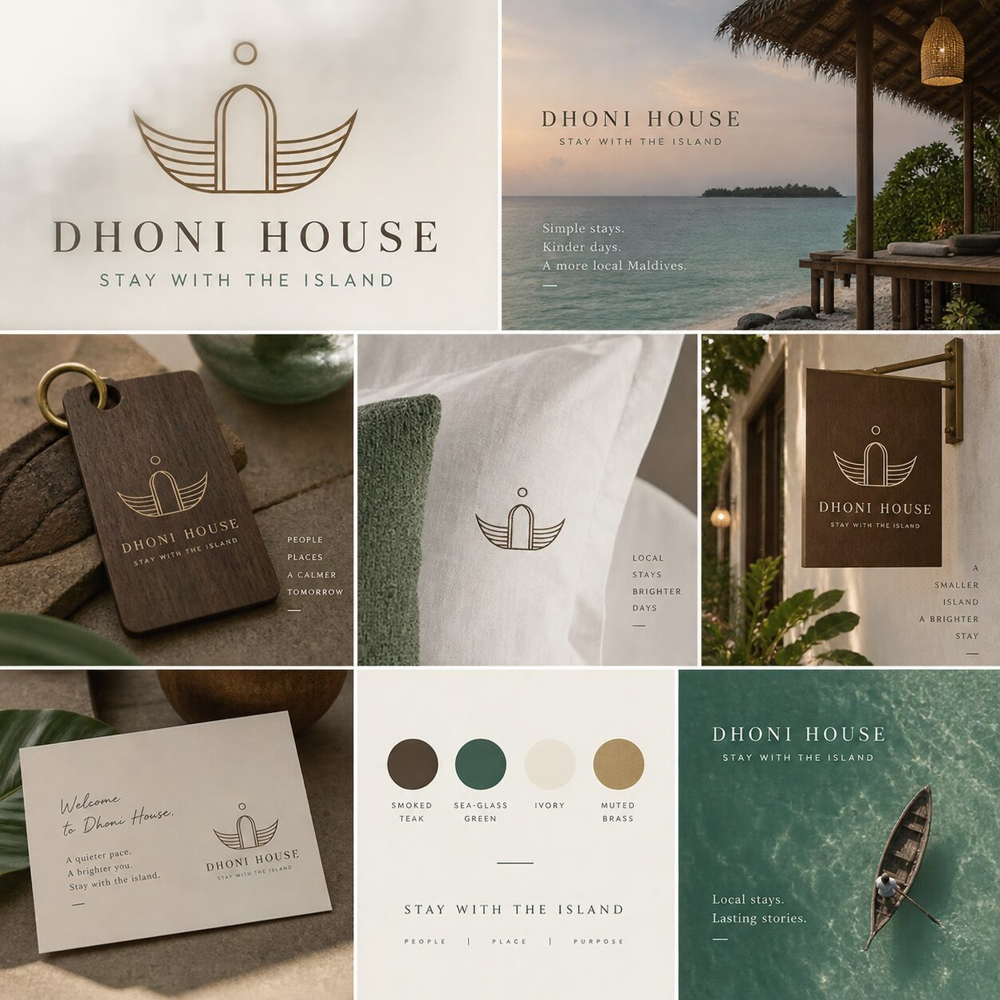
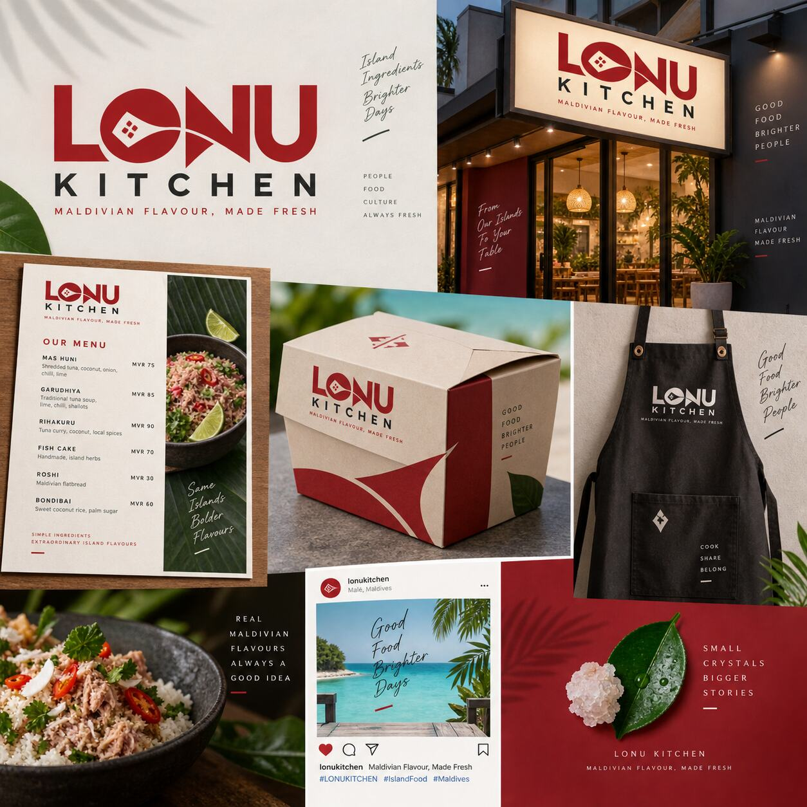
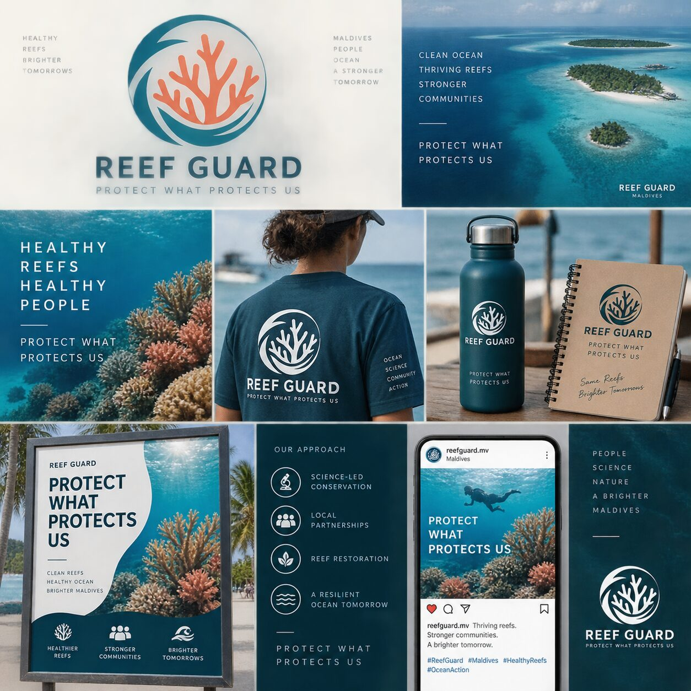
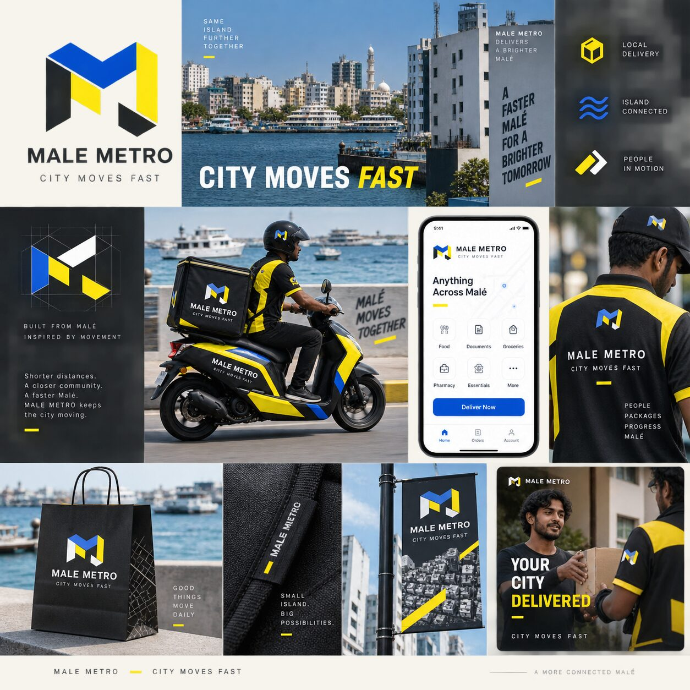
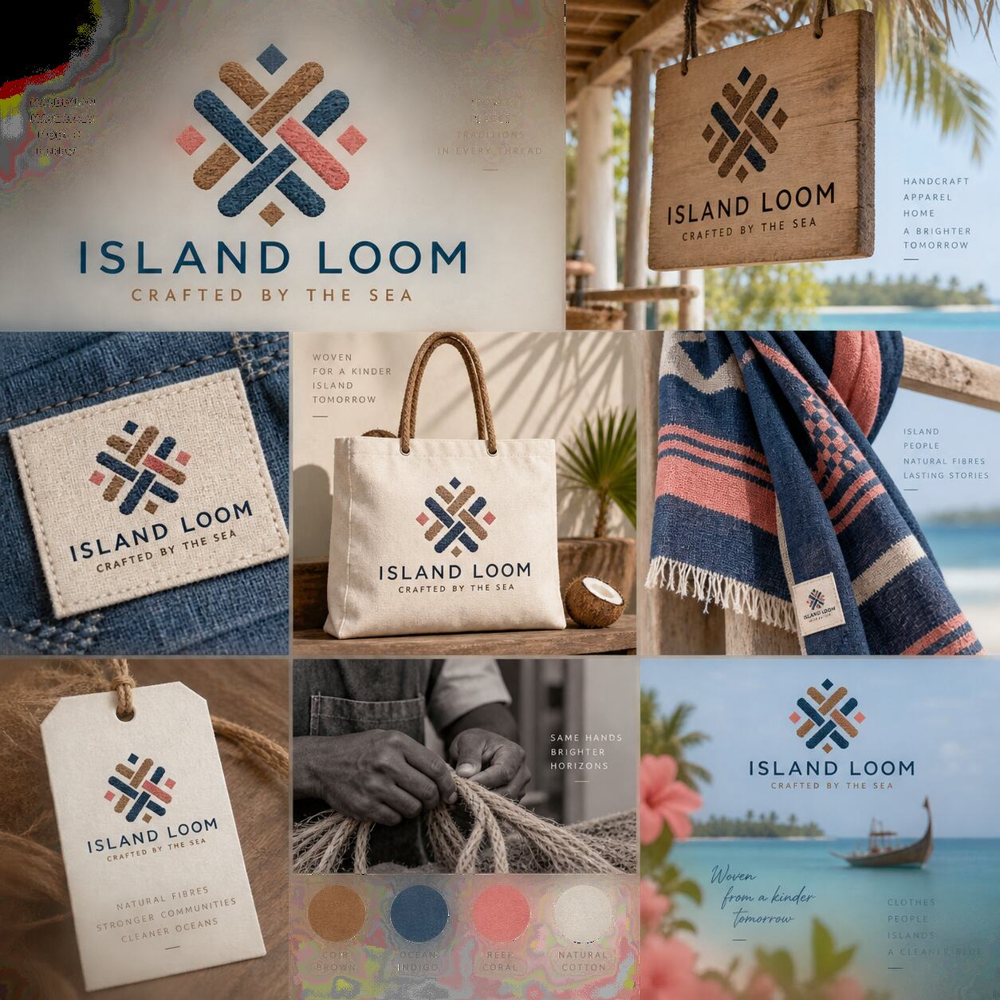
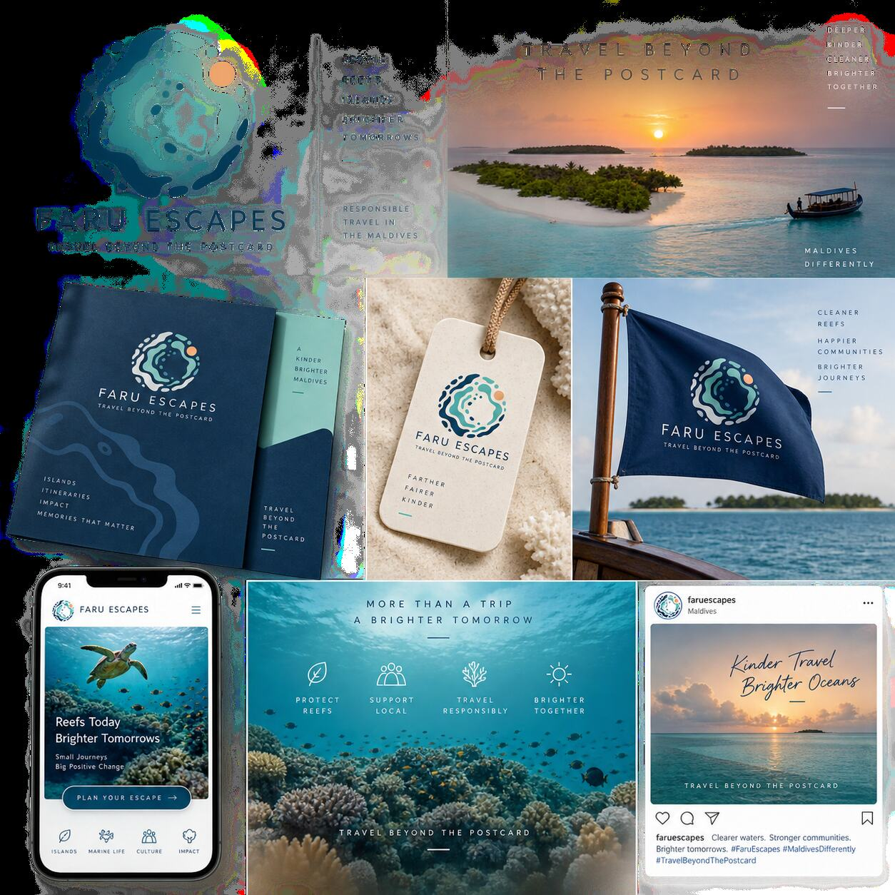
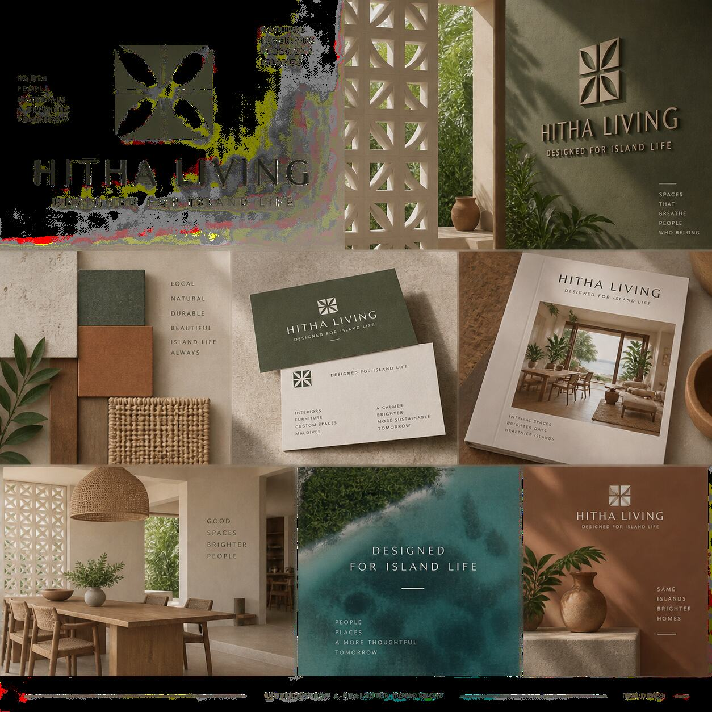

# Maldives Branding Concepts

### 10 Original Fictional Brand Identity Systems

A self-initiated collection by **Mohammad Forhad Reza**, exploring how contemporary branding can express the Maldives beyond familiar resort clichés.

> These are fictional portfolio concepts created to demonstrate branding, art direction, campaign thinking, and visual problem-solving. They are not commissioned client projects.

## 01 · Kandu Line

**Sector:** Inter-island transport  
**Idea:** A fast, dependable connection between island communities. The sail-and-wave mark combines Maldivian maritime character with a modern mobility system.

**Applications:** Ferry livery, ticketing, mobile booking and social media.

## 02 · Atoll Harvest

**Sector:** Local agriculture and food  
**Idea:** A breadfruit-inspired identity celebrating island-grown produce, stronger local supply chains and sustainable packaging.

**Applications:** Market signage, produce labels, spice packaging and reusable bags.

## 03 · Raalhu Studio

**Sector:** Creative and surf culture  
**Idea:** An energetic wave symbol for a Maldives-based creative community with a bold, youthful and globally relevant voice.

**Applications:** Surfboard graphics, apparel, stickers, posters and digital content.

## 04 · Dhoni House

**Sector:** Boutique hospitality  
**Idea:** A quiet monoline symbol merging the form of a dhoni with a welcoming doorway—positioning local hospitality as intimate and refined.

**Applications:** Signage, room accessories, linen and guest materials.

## 05 · Lonu Kitchen

**Sector:** Contemporary Maldivian dining  
**Idea:** A confident food identity rooted in local flavour, fresh preparation and everyday island culture.

**Applications:** Restaurant signage, menus, takeaway packaging, uniforms and campaigns.

## 06 · Reef Guard

**Sector:** Marine conservation  
**Idea:** Coral protected within a circular ocean form, creating a credible campaign system for science, community action and reef restoration.

**Applications:** Volunteer apparel, field equipment, awareness posters and social campaigns.

## 07 · Malé Metro

**Sector:** Urban delivery technology  
**Idea:** A compact geometric identity inspired by city blocks, movement and the fast rhythm of contemporary Malé.

**Applications:** Courier uniforms, delivery vehicles, packaging, mobile app and outdoor advertising.

## 08 · Island Loom

**Sector:** Craft and apparel  
**Idea:** A woven modular mark inspired by natural fibres, coir work and the value of locally made objects.

**Applications:** Fabric labels, apparel, scarves, tote bags and retail tags.

## 09 · Faru Escapes

**Sector:** Responsible island travel  
**Idea:** An abstract reef-ring symbol for meaningful journeys that support local communities and protect marine environments.

**Applications:** Itineraries, luggage tags, boat flags, mobile trip planning and social media.

## 10 · Hitha Living

**Sector:** Sustainable island interiors  
**Idea:** A geometric ventilation-block symbol reflecting naturally cooled homes, tactile materials and thoughtful island living.

**Applications:** Showroom identity, material library, stationery, catalogues and social content.

## Design Approach

1. Start with a real Maldives-specific need or opportunity.
2. Avoid generic resort and palm-tree branding.
3. Translate local context into a simple visual idea.
4. Build a flexible identity across physical and digital applications.
5. Present the result as a clear business solution.

## Creative Direction

| Area | Focus |
|---|---|
| Identity | Original marks with clear strategic ideas |
| Typography | Contemporary, legible and sector-appropriate |
| Color | Inspired by island life without repeating one palette |
| Mockups | Realistic applications that explain how each brand works |
| Social | Campaign-ready visual systems with strong hierarchy |

## About the Designer

I am **Mohammad Forhad Reza**, a graphic designer with **8 years of creative experience in the Maldives**. My tools include CorelDRAW, Adobe Illustrator, Affinity Designer and Canva.

[Main GitHub Profile](https://github.com/designerhubbyreza) · [LinkedIn](https://www.linkedin.com/in/mohammad-forhad-reza-60761a438/) · [Social Media Portfolio](https://github.com/designerhubbyreza/social-media-designs)
